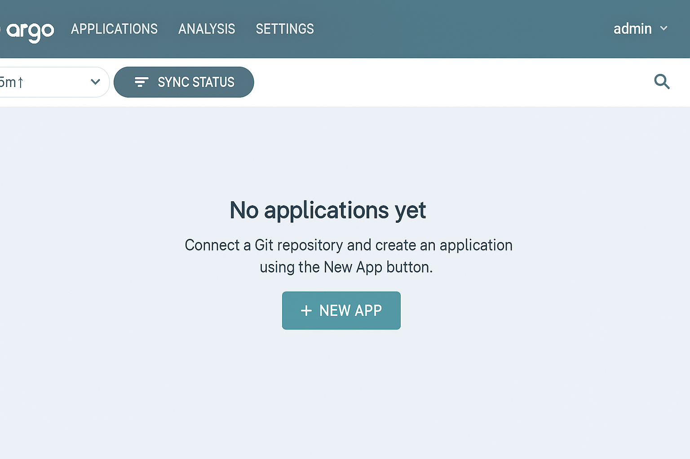
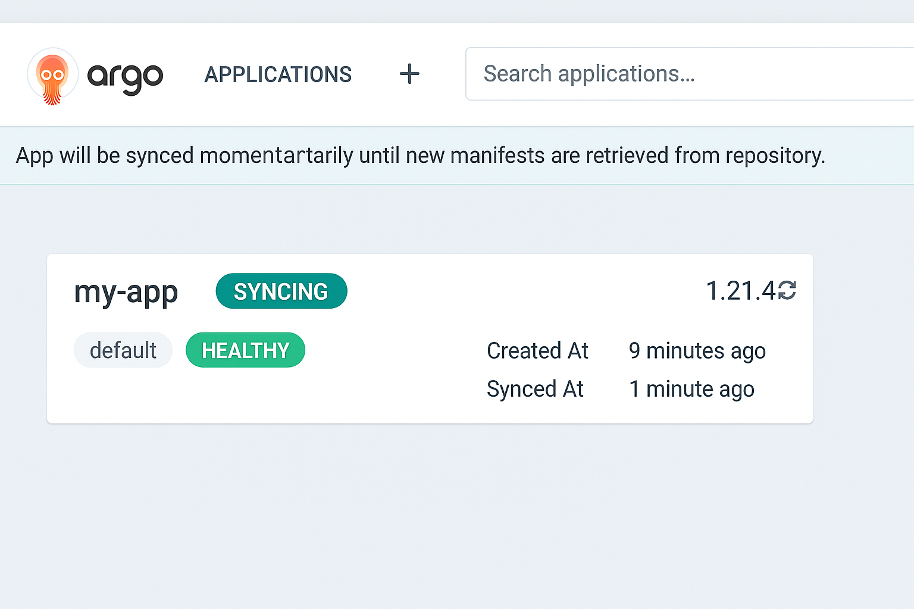
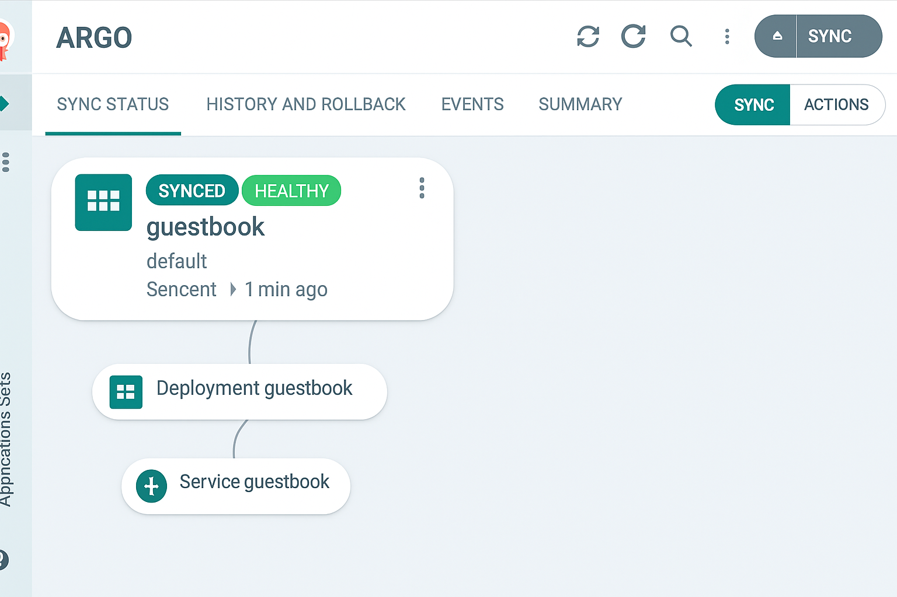
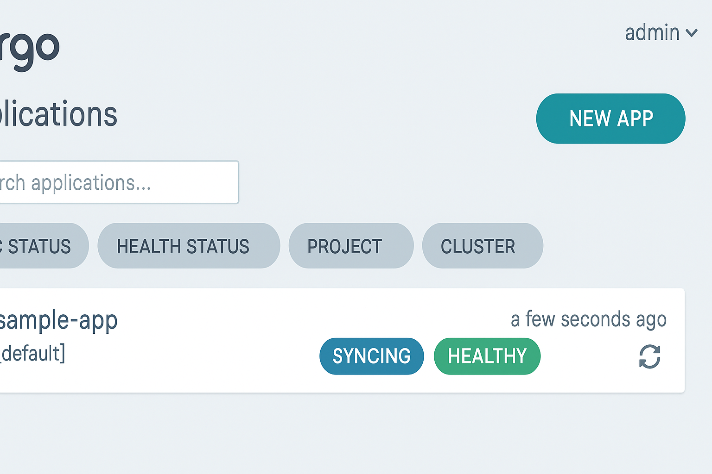
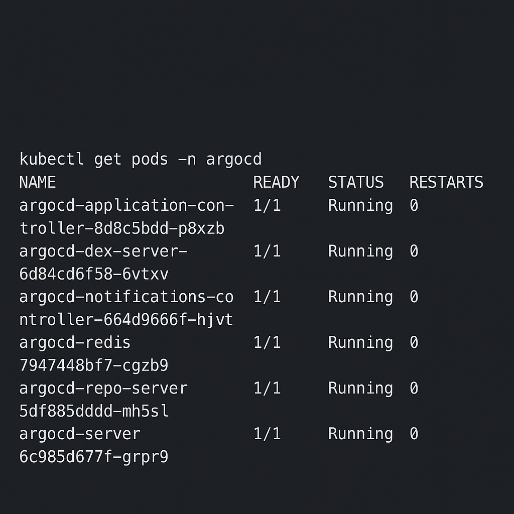

GitOps with ArgoCD & Kubernetes

This is a hands-on project where I implemented GitOps using ArgoCD on a local Kubernetes cluster (Minikube). The goal was to automatically sync and deploy a sample application whenever changes are pushed to a Git repository.

---

Project Overview

In this project, I’ve:

Set up a local Kubernetes cluster using Minikube
  Installed ArgoCD to manage the cluster
  Created Kustomize manifests for a sample NGINX application
  Configured ArgoCD to sync changes from a Git repo automatically
 Verified the full GitOps workflow with screenshots

---

 Tech Stack

 Kubernetes (Minikube)
ArgoCD
Git
Kustomize
kubectl

---

 Project Structure

```
gitops-argocd-k8s-project/
├── apps/
│   └── myapp/
│       └── base/
│           ├── deployment.yaml
│           ├── service.yaml
│           └── kustomization.yaml
├── argocd/
│   └── app.yaml
├── screenshots/
│   ├── app-dashboard.png
│   ├── auto-sync-after-git-commit.png
│   ├── final-argocd-healthy-synced.png
│   ├── repo-connection.png
│   ├── sync-detail.png
│   └── updated-pod.png
└── README.md
```

---

 What's Included

A working example of GitOps flow using ArgoCD
YAML files for app deployment and service
ArgoCD `Application` manifest for auto-syncing
 Screenshot evidence of the setup working properly

---

 How to Set It Up (Step-by-Step)

 Start Minikube

```bash
minikube start
```

 2. Install ArgoCD

```bash
kubectl create namespace argocd

kubectl apply -n argocd \
  -f https://raw.githubusercontent.com/argoproj/argo-cd/stable/manifests/install.yaml
```

 3. Access the ArgoCD UI

```bash
kubectl -n argocd port-forward svc/argocd-server 8080:443
```

Go to: [https://localhost:8080](https://localhost:8080)

Default credentials:

```bash
kubectl get secret argocd-initial-admin-secret -n argocd -o jsonpath="{.data.password}" | base64 -d
```

 4. Deploy the Application

```bash
kubectl apply -n argocd -f argocd/app.yaml
```

ArgoCD will now connect to the Git repo and deploy the app automatically.

---

 How the GitOps Flow Works

1. You make a change to your Kubernetes YAML files in Git (like updating the image tag).
2. You commit and push the changes to your GitHub repo.
3. ArgoCD detects the change and auto-syncs it to the cluster.
4. Kubernetes gets updated — all without any manual `kubectl apply`.

---

 Screenshots of GitOps in Action

 1. ArgoCD Dashboard

Shows the main ArgoCD UI with my application listed. 

---

 2. Auto-Sync Triggered After Git Push

ArgoCD automatically synced after a commit was pushed to Git. 

---

 3. Final Status - Healthy and Synced

Everything is successfully deployed and running fine. 

---

 4. Git Repository Connected

ArgoCD is connected to the correct GitHub repository. 

---

 5. Sync Detail View

Detailed status inside the app view showing **Synced** and **Healthy**. 

---

 6. Updated Pods after Git Commit

Pods were updated after changing the image tag and pushing to Git. 

---

Why This Matters

  Automation: No need to manually apply manifests after Git push.
  Reliability: ArgoCD ensures the cluster always matches the latest config.
  Visibility: ArgoCD UI gives full insight into what’s deployed and what changed.
  Real-time Deployment: Everything updates automatically just by pushing to Git.


 Final Thoughts

This project helped me understand how GitOps works in real-time using ArgoCD.
It’s a powerful and clean way to manage Kubernetes applications — and everything is driven by Git commits.
No manual deployments, no missed updates — just clean, automated sync.


